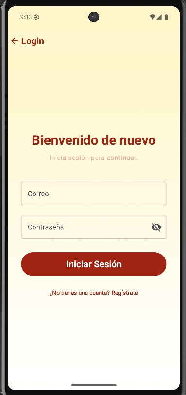
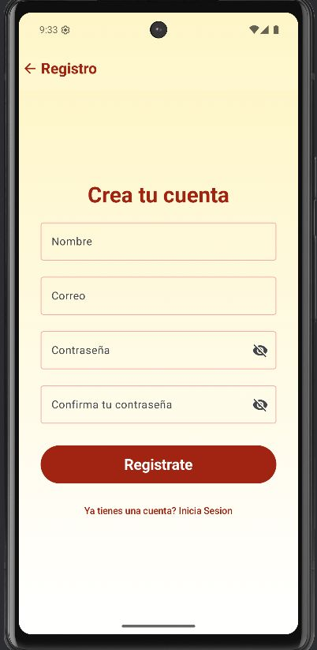
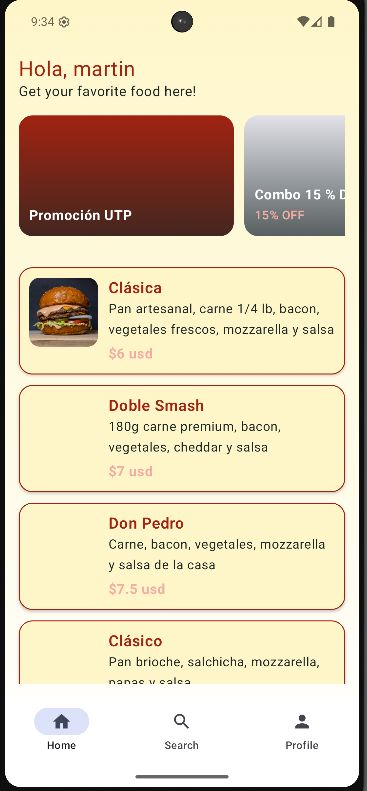
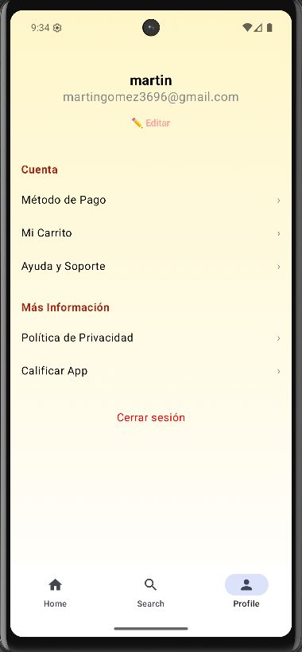
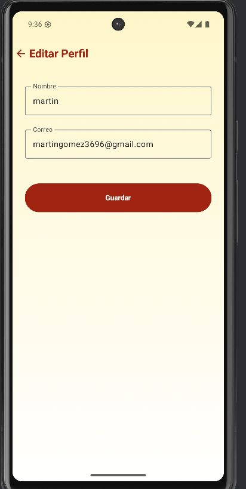

markdown
# Don Pedro Street Food · App Android

## 1. Introducción

Aplicación móvil oficial de Don Pedro Street Food desarrollada en Kotlin + Jetpack Compose.
Permite a los clientes registrarse, explorar el menú, añadir productos al carrito y pagar sus pedidos, mientras aplica la identidad visual (PrimaryRed, SecondarySalmon, TertiaryCream) definida para la marca. La app consume la API NestJS publicada en donpedro-backend.

## 2. Tabla de contenido
1. Introducción
2. Tabla de contenido
3. Pantallas principales
4. Tecnologías utilizadas
5. Cómo compilar y ejecutar

## 3. Pantallas principales

| Módulo        | Pantalla            | Captura                                           |
|---------------|---------------------|---------------------------------------------------|
| Autenticación | Login               |       |
| Autenticación | Registro            |  |
| Home          | Catálogo            |              |
| Perfil        | Opciones del Perfil |             |
| Editar Perfil | Edicion de Perfil   |     |

> **Nota:** Si aún no tienes todas las vistas implementadas, crea la estructura de carpetas `screenshots/` y agrega las imágenes cuando estén listas siguiendo la numeración mostrada.

## 4. Tecnologías utilizadas

- **Kotlin** como lenguaje principal.
- **Jetpack Compose** para UI declarativa.
- **Material 3** y tema personalizado (Palette: PrimaryRed, SecondarySalmon, TertiaryCream).
- **Navigation-Compose** para navegación entre pantallas.
- **Retrofit 2 + Gson** para consumo de la API REST.
- **DataStore Preferences** para almacenamiento ligero (tokens, flags de onboarding).
- **Coil Compose** para carga de imágenes remotas.
- **Coroutines y Flow** para operaciones asíncronas y estados de UI.
- **Gradle KTS** con Compile SDK 36, Min SDK 24, Target SDK 36.

## 5. Cómo compilar y ejecutar

### 1. Requisitos previos
- Android Studio Flamingo (o superior) con JDK 17 integrado.
- Android SDK 36 y emulador o dispositivo físico con Android 8.0+.

### 2. Clonar el repositorio
```bash
git clone https://github.com/martingom4/Front-end-DonPedro.git
cd Front-end-DonPedro
```

### 3. Configurar variables
- Crea `local.properties` con `backendUrl=http://10.0.2.2:3000` (o la URL de la API).

### 4. Sincronizar e iniciar
- Abre el proyecto en Android Studio.
- Pulsa **Sync Project**, luego **Run ▶︎** sobre un emulador o dispositivo.

---
```